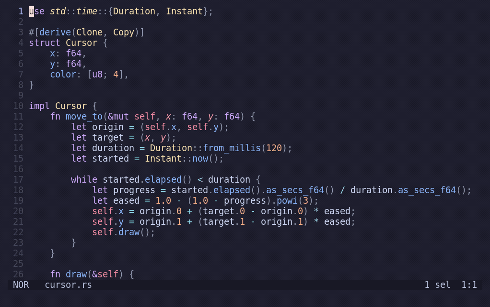

<div align="center">

<h1>
<picture>
  <source media="(prefers-color-scheme: dark)" srcset="logo_dark.svg">
  <source media="(prefers-color-scheme: light)" srcset="logo_light.svg">
  
</picture>
</h1>

[](https://github.com/helix-editor/helix/actions)
[](https://github.com/helix-editor/helix/releases/latest)
[](https://docs.helix-editor.com/)
[](https://github.com/helix-editor/helix/graphs/contributors)
[](https://matrix.to/#/#helix-community:matrix.org)

</div>

# Changes in this fork

This fork adds a Neovide-inspired cursor smear, richer LSP color previews, and
performance improvements throughout editing, rendering, and background work.

## Cursor smear and color previews

- **Neovide-inspired cursor smear:** a pixel-rendered cursor whose corners stretch
  and settle as it moves, using the Kitty graphics protocol in direct Kitty and
  Ghostty sessions. It follows the configured block, bar, or underline shape and
  animates long jumps, including `gw` jumps that scroll the destination into view.
  Animation frames run independently of full editor redraws and stop when the
  cursor settles. The feature is opt-in; other terminals and sessions inside
  tmux, GNU Screen, or Zellij use the ordinary cursor.
- **Tailwind CSS and LSP colors:** inline color swatches in both hover popups and
  editor text, using the referenced text's background so diff and selection
  highlighting stay visible. Hover previews recognize CSS
  colors, including hex, named colors, RGB/HSL, and modern Lab/LCH/OKLab/OKLCH
  values, plus Tailwind v4 resolved-color comments. Editor previews use colors
  reported by the language server. Swatches are enabled by default;
  optional color-value backgrounds are disabled by default.

Add this to your Helix `config.toml` to enable the cursor animation and color
swatches:

```toml
[editor.cursor-smear]
enabled = true
duration = 120 # milliseconds
max-distance = 40

[editor.lsp]
display-color-swatches = true
display-color-values = false
```

See the [cursor configuration](./book/src/configuration.md) and
[LSP display settings](./book/src/editor.md#editorlsp-section) for details.

Cursor smear recorded in Ghostty with a 120 ms animation duration:



## Review mode

Use `z r` or `:review-mode` to toggle a Git diff in the current view
(`:review-mode on` and `:review-mode off` also work). The default base is HEAD.
Use `:review-mode main` or `:review-mode origin/main` to review the current buffer
against the common ancestor of HEAD and that revision, like a pull request.
This includes committed branch changes and unsaved edits while excluding changes
made only on the target branch. `:review-mode HEAD` returns to local changes.
The selected base is remembered for the buffer; repeat the revision command to
refresh its pinned commit. These commands use local Git references.
`:diff-mode` is an alias for `:review-mode`.

Added and changed rows have a
green background and a `+` gutter before the line numbers. Diff backgrounds cover
the full row, including its gutters. Deleted rows use a red background and a
`-` gutter. All deleted lines remain visible before the added lines.
Deleted text uses a separate syntax pass over the original file, preserving
multiline strings, comments, and embedded languages. Use `j`/`k` or the arrow
keys to navigate onto deleted rows.
Use `v` with character, word, or line movements to select old text, `x` to select
lines, `%` to select the deleted block, and `y` or clipboard yank commands to
copy it. Mouse dragging also selects old text. Selections stay within one deleted
block. Review mode is read-only for the entire buffer, including current source
rows. Editing, undo/redo, formatting, pasting, saving, and language-server edits
are disabled while any view of the buffer is in review mode. Use `:review-mode off`
to resume editing. Deleted lines follow horizontal scrolling and do not soft-wrap.
Page Up/Down keep the cursor at the visible edge, including within deleted rows.
Ctrl-U/D move the cursor with the viewport. Mouse scrolling can leave the cursor
offscreen while reviewing deleted text; moving the cursor brings it back into view.
While review mode is on, `]d`/`[d` jump through diff hunks and LSP diagnostics
together; `[D`/`]D` go to the first/last stop. Each hunk is one stop, with deletions
focused on their old text. Counts such as `3]d` skip multiple stops.
Themes can customize the backgrounds with `ui.diff.added` and `ui.diff.deleted`.

## Performance improvements

- **Editor rendering:** reuse unchanged view contents and cache visible syntax
  highlights, rainbow brackets, textobject queries, and decorations to reduce
  repeated parsing, queries, and drawing.
- **Scrolling and cursor positioning:** cache layout and grapheme checkpoints
  so movement and scrolling through long, soft-wrapped lines can resume near
  the target instead of repeatedly scanning from the line's start.
- **Text layout:** reuse annotation measurements and paragraph wrapping, with
  ASCII fast paths for common text and grapheme-aware handling for Unicode.
- **Popups and documentation:** cache parsed Markdown, styled content, dimensions,
  and signature-help layouts across redraws.
- **Pickers and completion menus:** cache rendered rows and previews, limit work
  to visible rows, reuse fuzzy matchers, and score large completion sets in
  parallel while preserving candidate order. Stale background requests are
  canceled.
- **Word completion:** update the word index incrementally from changed regions,
  stream ASCII word extraction, and prepare updates for different documents
  concurrently. Superseded revisions are coalesced or canceled before their
  results reach the index.
- **Background concurrency:** share a bounded CPU worker pool between indexing,
  completion scoring, and large LSP decoding jobs. Picker, search, and Git work
  also have worker limits to reduce contention with interactive editing.
- **LSP decoding:** use SIMD-assisted JSON parsing, retain incoming parameters
  and results as raw JSON, and decode directly into their target types. Large
  payloads are decoded on background workers.
- **Language-server updates:** coalesce queued full-document changes and
  serialize their snapshots in the background while preserving request order.
- **Diagnostics:** batch incoming updates, coalesce superseded publications,
  prepare large batches off the editor loop, and reuse diagnostic range and
  annotation data during rendering.
- **Debugger responsiveness:** fetch thread lists and stack traces asynchronously
  and discard replies that belong to an outdated debugger session or request.
- **Input and terminal output:** process bursts of ready events before drawing,
  skip unchanged terminal rows, and stream changed cells to the backend without
  allocating a separate diff vector.
- **Cursor graphics:** fill solid image regions in bulk, reserve antialiasing
  work for edges, and reuse a SIMD-capable zlib compressor and output buffers
  between frames in Kitty. Ghostty uses uncompressed RGBA transfers to avoid
  crashes in its zlib decoder.
- **Search and multiple selections:** cache repeated reverse-search scans and
  reuse grapheme traversal when mapping many selection endpoints through edits.
- **Diffs and Git integration:** skip equal text edges, bound expensive character
  diffs, reuse diff storage, and prepare Git baselines and changed-file scans on
  cancellable background workers.
- **Optimized builds:** provide native CPU builds and a profile-guided
  optimization (PGO) workflow that builds, trains on editing workloads, merges
  profiles, and installs the resulting binary.

The fork also includes correctness fixes for LSP/DAP request cancellation and
cleanup, workspace edits and queued saves, Unicode handling, stale asynchronous
results, and cache invalidation when configuration or themes change.

## Building this fork

From the repository root, with Rust and `just` installed:

```sh
just install
```

This uses the `opt` profile and `target-cpu=native` for the build machine's CPU.
The repository pins a dated nightly in [rust-toolchain.toml](./rust-toolchain.toml).
CI checks the optimized build alongside the minimum stable Rust version.
To build with PGO, also install Python 3 and the matching LLVM tools:

```sh
rustup component add llvm-tools-preview
just install-pgo
```

PGO runs two builds, and its benefit depends on how closely the training matches
your editing workload. See [building from source](./book/src/building-from-source.md)
for runtime setup, requirements, and training with your own projects.

The [terminal smoke tests](./docs/CONTRIBUTING.md#terminal-smoke-tests) check
cursor graphics, terminal fallback, and review mode through the real terminal
backend without requiring a display server.


A [Kakoune](https://github.com/mawww/kakoune) / [Neovim](https://github.com/neovim/neovim) inspired editor, written in Rust.

The editing model is very heavily based on Kakoune; during development I found
myself agreeing with most of Kakoune's design decisions.

For more information, see the [website](https://helix-editor.com) or
[documentation](https://docs.helix-editor.com/).

All shortcuts/keymaps can be found [in the documentation on the website](https://docs.helix-editor.com/keymap.html).

[Troubleshooting](https://github.com/helix-editor/helix/wiki/Troubleshooting)

# Features

- Vim-like modal editing
- Multiple selections
- Built-in language server support
- Smart, incremental syntax highlighting and code editing via tree-sitter

Although it's primarily a terminal-based editor, I am interested in exploring
a custom renderer (similar to Emacs) using wgpu.

Note: Only certain languages have indentation definitions at the moment. Check
`runtime/queries/<lang>/` for `indents.scm`.

# Installation

[Installation documentation](https://docs.helix-editor.com/install.html).

[](https://repology.org/project/helix-editor/versions)

# Contributing

Contributing guidelines can be found [here](./docs/CONTRIBUTING.md).

# Getting help

Your question might already be answered on the [FAQ](https://github.com/helix-editor/helix/wiki/FAQ).

Discuss the project on the community [Matrix Space](https://matrix.to/#/#helix-community:matrix.org) (make sure to join `#helix-editor:matrix.org` if you're on a client that doesn't support Matrix Spaces yet).

# Credits

Thanks to [@jakenvac](https://github.com/jakenvac) for designing the logo!
